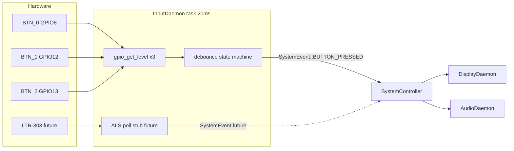

# Three Buttons with Polling InputDaemon (No ISR)

## Architecture



**Design choice:** No `gpio_install_isr_service`, no `gpio_isr_handler_add`, no `xQueueSendFromISR`. InputDaemon owns all button GPIO init and polls every 20 ms — same cadence as `DisplayDaemon` and `SystemController`.

This matches your existing input pattern (`CliDaemon` → `SystemController` queue) and keeps debounce logic in one dedicated task.

---

## Hardware

| Button | Net | GPIO | Function |
|--------|-----|------|----------|
| SW1 | `BTN_0` | GPIO8 | Alarm stop / random-next |
| SW2 | `BTN_1` | GPIO12 | Mode cycle |
| SW3 | `BTN_2` | GPIO13 | Profile cycle |

- Add SW2/SW3 to [hardware/main_board/main_board.kicad_sch](hardware/main_board/main_board.kicad_sch) and [hardware/main_board/main_board.kicad_pcb](hardware/main_board/main_board.kicad_pcb): duplicate SW1 circuit (10k pull-up to +3V3, active-low tact switch `XKB5858-W-E-75`).
- **Fix firmware pin conflict:** PCB routes DS3231 `~RTC_INT` to **GPIO2**, but [src/system_controller.cpp](src/system_controller.cpp) uses `kRtcIntPin = GPIO8` (actually `BTN_0`). Change RTC INT to GPIO2; do not configure GPIO8 as RTC.

---

## 1) New InputDaemon (polling only)

**New files:**
- [src/daemons/input_daemon.h](src/daemons/input_daemon.h)
- [src/daemons/input_daemon.cpp](src/daemons/input_daemon.cpp)

**GPIO init (in InputDaemon, not SystemController):**
```cpp
gpio_config_t cfg = {
    .pin_bit_mask = (1ULL << GPIO8) | (1ULL << GPIO12) | (1ULL << GPIO13),
    .mode = GPIO_MODE_INPUT,
    .pull_up_en = GPIO_PULLUP_ENABLE,
    .intr_type = GPIO_INTR_DISABLE,   // no ISR
};
gpio_config(&cfg);
```

**Poll loop (20 ms):**
```cpp
void InputDaemon::loop() {
    while (true) {
        for (uint8_t i = 0; i < 3; ++i) {
            bool raw = (gpio_get_level(kButtonPins[i]) == 0);  // active-low
            if (process_debounce(i, raw)) {
                post_button_pressed(i);  // xQueueSend to SystemController
            }
        }
        // future: poll_als() here on same tick
        vTaskDelay(pdMS_TO_TICKS(20));
    }
}
```

**Debounce state machine per button:**
- Track `stable_level`, `pending_since`, `last_fire_tick`.
- On stable LOW for `kDebounceMs` (50 ms) after previously HIGH → fire one `BUTTON_PRESSED`.
- Ignore re-triggers until pin returns HIGH (release) and `kInterPressMs` (200 ms) elapsed.
- No internal ISR queue needed.

**Constructor / start:**
- Takes `SystemController&`; stores `system_controller_.get_queue()`.
- `start()` creates FreeRTOS task (priority 5–6, stack 2048–3072).

**Wire in [src/main.cpp](src/main.cpp):**
```cpp
static InputDaemon input_daemon(system_controller);
// after system_controller constructed:
input_daemon.start();
```

---

## 2) SystemController — button policy

Implement the existing stub in [src/system_controller.cpp](src/system_controller.cpp):

```289:297:c:\Users\JOHNSON.CL.CHEN\Documents\nixietube_clock\src\system_controller.cpp
case SystemEvent::BUTTON_PRESSED:
    ESP_LOGI(TAG, "Button pressed: %d", msg.data.button_id);
    // Example: Toggle effect on button press
    ...
    break;
```

| `button_id` | Action |
|-------------|--------|
| 0 | If alarm audio playing → `AudioCmd::STOP`. Else if mode is `RANDOM_ANIMATION` → `DisplayCmd::RANDOM_NEXT`. |
| 1 | Cycle: `CLOCK_HHMMSS` → `DATE_YYMMDD` → `RANDOM_ANIMATION` → `CATHODE_POISONING` → wrap. Send `DisplayCmd::SET_MODE`. |
| 2 | Cycle profile index 0→1→2→3→0; apply backlight RGB/brightness/effect + nixie tube brightness; save to NVS. |

Add private state in `SystemController`:
- `current_display_mode_` (mirrored whenever mode changes)
- `alarm_audio_active_` (set in `check_alarm()`, cleared on stop)

**Remove** any button GPIO code from `SystemController::init_hardware()`. InputDaemon owns buttons exclusively.

---

## 3) Display modes and animations

Extend [lib/include/message_types.h](lib/include/message_types.h):

- `DisplayMode`: add `RANDOM_ANIMATION`, `CATHODE_POISONING`
- `DisplayCmd`: add `RANDOM_NEXT`, `SET_NIXIE_BRIGHTNESS`; extend `UPDATE_TIME` union with `yy/mm/dd`

Update [src/daemons/display_daemon.cpp](src/daemons/display_daemon.cpp):
- `DATE_YYMMDD`: call new `display_date(yy, mm, dd)` on mode entry and on each `UPDATE_TIME`
- `RANDOM_ANIMATION`: 150–300 ms timer in `loop()` generates random digits; `RANDOM_NEXT` forces immediate step
- `CATHODE_POISONING`: cycle digits 0–9 per tube on a schedule

Update [src/nixie_driver.cpp](src/nixie_driver.cpp) / [lib/include/nixie_driver.h](lib/include/nixie_driver.h):
- Add `display_date(uint8_t yy, uint8_t mm, uint8_t dd)`
- Expose tube intensity via existing `set_brightness()`

Extend [src/system_controller.cpp](src/system_controller.cpp) `update_time()` to include date fields in `UPDATE_TIME` messages.

---

## 4) Four backlight + tube-brightness profiles

Extend [src/system_state.h](src/system_state.h):

```cpp
struct BacklightProfile {
    uint8_t r, g, b;
    uint8_t backlight_brightness;
    uint8_t backlight_effect;
    uint8_t nixie_brightness;
};
// Add to ClockSettings or parallel struct:
BacklightProfile profiles[4];
uint8_t active_profile_index;
```

- Bump `kSettingsVersion` in [src/system_state.cpp](src/system_state.cpp) with NVS migration.
- Button 2 cycles `active_profile_index` and calls `apply_settings()`-equivalent display commands.
- Web UI ([src/web_page.cpp](src/web_page.cpp)): 4 profile slots with save buttons; tube brightness slider per slot.
- API ([src/web_server.cpp](src/web_server.cpp)): extend `/api/settings` GET/POST for profiles array.

---

## 5) Future ALS hook (stub only)

Reserve in [lib/include/message_types.h](lib/include/message_types.h):
- `SystemEvent::ALS_UPDATE` (or `AMBIENT_LIGHT_UPDATE`)

In InputDaemon, add empty stubs:
- `init_als()` — no-op for now
- `poll_als()` — called from same 20 ms loop; will read LTR-303ALS-01 over I2C0 when driver is added

Hardware already has LTR-303 on main board ([hardware/main_board/main_board.kicad_sch](hardware/main_board/main_board.kicad_sch)); ALS fits naturally as a polled input alongside buttons in InputDaemon.

---

## 6) Alarm stop

In `check_alarm()` ([src/system_controller.cpp](src/system_controller.cpp)):
- Set `alarm_audio_active_ = true` when sending `AudioCmd::PLAY_TRACK`
- Button 0 sends `AudioCmd::STOP` and clears flag

---

## File change summary

| Area | Files |
|------|-------|
| **New** | `src/daemons/input_daemon.h`, `src/daemons/input_daemon.cpp` |
| **Boot** | `src/main.cpp` |
| **Messages** | `lib/include/message_types.h` |
| **Policy** | `src/system_controller.cpp`, `src/system_controller.h` |
| **Display** | `src/daemons/display_daemon.cpp`, `src/daemons/display_daemon.h` |
| **Nixie** | `src/nixie_driver.cpp`, `lib/include/nixie_driver.h` |
| **Storage** | `src/system_state.h`, `src/system_state.cpp` |
| **Web** | `src/web_page.cpp`, `src/web_server.cpp` |
| **Hardware** | `hardware/main_board/main_board.kicad_sch`, `.kicad_pcb` |
| **Docs** | `README.md` (fix GPIO table: RTC_INT=GPIO2, buttons=GPIO8/12/13) |

**Explicitly NOT in scope:** `gpio_install_isr_service`, ISR handlers, `xQueueSendFromISR`, internal ISR queues.

---

## Test plan

1. Each button press logs exactly one `BUTTON_PRESSED` (no double-fire on bounce).
2. Rapid tapping does not queue multiple mode/profile changes.
3. Button 0 stops alarm; in random mode advances digits immediately.
4. Button 1 cycles all four display modes in order.
5. Button 2 cycles profiles 0–3; LED + tube brightness change; survives reboot.
6. Buttons remain responsive during RTC/gas-gauge I2C in SystemController (20 ms poll is independent).
