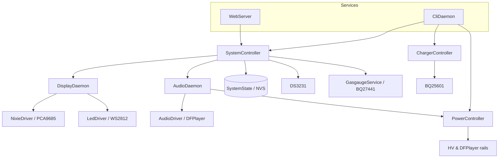

# Nixie Clock Firmware

ESP-IDF firmware for a 6-tube Nixie clock powered by an ESP32-S3. The clock drives multiplexed IN-18 (or IN-4) tubes with RGB backlighting, audio playback, battery management, and a built-in web configuration UI.

## Features

- **6-tube display** — Multiplexed control via PCA9685 PWM drivers and a 74HC238 anode mux.
- **RGB backlight** — WS2812 addressable LEDs (4 per tube) with static, breath, rainbow, and off effects.
- **Audio** — DFPlayer Mini integration for sound effects and announcements.
- **RTC** — DS3231 for precise timekeeping with periodic resync to ESP32 system time.
- **Web UI** — Wi-Fi access point and HTTP server for settings and time configuration from a phone or laptop.
- **Serial CLI** — Interactive console for development, diagnostics, and power-rail control.
- **Power management** — BQ25601 battery charger, BQ27441 fuel gauge, and switched HV / DFPlayer rails.
- **Persistent settings** — Clock preferences stored in NVS and restored on boot.
- **Modular architecture** — FreeRTOS daemons coordinated by a central system controller.

## Hardware Configuration

Pin assignments are defined in `src/system_controller.cpp` and `lib/drivers/power_switch/gpio_power_switch.h`.

| Peripheral | Pin Name | GPIO | Description |
| :--- | :--- | :--- | :--- |
| **I2C** | SDA | GPIO 6 | I2C data (DS3231, PCA9685, BQ25601, BQ27441) |
| | SCL | GPIO 5 | I2C clock (400 kHz) |
| **UART** | TX | GPIO 18 | Audio TX → DFPlayer RX |
| | RX | GPIO 17 | Audio RX ← DFPlayer TX |
| **GPIO** | RTC_INT | GPIO 2 | DS3231 interrupt (active low) |
| | BTN_0 | GPIO 8 | Alarm stop / divergence re-trigger |
| | BTN_1 | GPIO 12 | Display mode cycle |
| | BTN_2 | GPIO 13 | Backlight profile cycle |
| | PCA_OE | GPIO 4 | PCA9685 output enable (active low) |
| | ANODE_A0–A2 | GPIO 9–11 | 74HC238 anode mux address lines |
| | HV_PWR | GPIO 15 | HV power rail enable (via `GpioPowerSwitch`) |
| | DF_PWR | GPIO 16 | DFPlayer power rail enable (via `GpioPowerSwitch`) |
| **RMT** | LED_DATA | GPIO 7 | WS2812 LED data line |

KiCad schematics and PCB layouts for the main board, display boards (IN-18 / IN-4), and HV power supply live under `hardware/`.

## Architecture

The firmware runs on FreeRTOS and uses a daemon-based design. `SystemState` holds shared, thread-safe snapshots of settings, battery, and time status.



### System Controller (`src/system_controller.cpp`)

Central coordinator that:

- Initializes I2C, UART, RMT, and GPIO peripherals.
- Owns the DS3231 RTC and maintains ESP32 system time (UTC).
- Periodically resyncs from the RTC and publishes time status.
- Polls the BQ27441 fuel gauge and updates battery status.
- Dispatches 1 Hz time updates to `DisplayDaemon`.
- Accepts thread-safe settings changes from the web UI and CLI.

### Display Daemon (`src/daemons/display_daemon.cpp`)

Manages all visual output:

- Drives Nixie tubes via `NixieDriver` (dedicated high-priority multiplexing task).
- Drives LED backlights via `LedDriver`.
- Runs the LED effects engine (static, breath, rainbow, off).
- Updates hardware at 50 Hz.

### Audio Daemon (`src/daemons/audio_daemon.cpp`)

Handles asynchronous audio commands (play, stop, volume) and communicates with the DFPlayer Mini. Uses `PowerController` to switch the DFPlayer power rail.

### Web Server (`src/web_server.cpp`, `src/web_page.cpp`)

Starts a Wi-Fi access point and embedded HTTP server:

| Setting | Value |
| :--- | :--- |
| SSID | `NixieClock` |
| Password | `nixie2026` |
| AP IP | `192.168.8.8` |

Connect to the AP and open `http://192.168.8.8/` in a browser.

| Endpoint | Method | Description |
| :--- | :--- | :--- |
| `/` | GET | Settings web UI |
| `/api/settings` | GET | Current clock settings (JSON) |
| `/api/settings` | POST | Apply settings and optional time (JSON) |
| `/api/time` | GET | Local time, RTC status, temperature (JSON) |

Configurable settings include timezone offset, alarm, backlight color/brightness/effect, and volume.

### CLI Daemon (`src/daemons/cli_daemon.cpp`)

Serial console at **115200 baud** for development and diagnostics. Type `help` for the full list. Notable commands:

| Command | Description |
| :--- | :--- |
| `set_nixie --number <n>` | Display a number on the tubes |
| `set_backlight --rgb R,G,B --brightness N` | Set backlight color and brightness |
| `get_uuid` / `get_hw_version` / `get_fw_version` | Device identification |
| `ggtool` | BQ27441 fuel-gauge diagnostics |
| `get_bq25601_status` | Charger status registers |
| `enable_charging` / `disable_charging` | Control battery charging |
| `enable_hv` / `disable_hv` | Control HV power rail |
| `enable_df_power` / `disable_df_power` | Control DFPlayer power rail |
| `reboot` | Restart the device |

See `test/test_cli/README.md` for a manual test plan and automated test script.

### Drivers (`lib/drivers/`, `src/*_driver.cpp`)

| Driver | Role |
| :--- | :--- |
| `NixieDriver` | 4× PCA9685 chips driving 6 tubes with multiplexing |
| `LedDriver` | RMT-based WS2812 control |
| `AudioDriver` | High-level DFPlayer Mini interface |
| `Ds3231` | RTC read/write and temperature |
| `Bq25601` | Battery charger IC |
| `Bq27441` | Fuel gauge IC |
| `GpioPowerSwitch` | HV and DFPlayer power-rail switching |

## Building and Flashing

This project uses [PlatformIO](https://platformio.org/) with the ESP-IDF framework.

### Prerequisites

- [PlatformIO](https://platformio.org/install) (CLI or VS Code extension)

### Environments

| Environment | Board | Use case |
| :--- | :--- | :--- |
| `esp32_s3_devkitc_1` (default) | ESP32-S3-DevKitC-1 | General development |
| `eps32_s3_nixie` | Custom `esp32-s3-nixie` | Production Nixie clock board |

### Build

```bash
pio run
```

Build for the Nixie board:

```bash
pio run -e eps32_s3_nixie
```

### Flash

Connect the ESP32-S3 via USB, then:

```bash
pio run -t upload
```

### Monitor

View serial logs (115200 baud):

```bash
pio run -t monitor
```

The build embeds the current git commit hash via `generate_git_version.py`.

## Directory Structure

```
├── src/                  # Application source
│   ├── daemons/          # Display, Audio, and CLI tasks
│   ├── main.cpp          # Entry point and startup sequence
│   ├── system_controller.cpp
│   ├── system_state.cpp  # Shared state and NVS persistence
│   ├── web_server.cpp    # Wi-Fi AP and HTTP API
│   ├── web_page.cpp      # Embedded settings UI
│   ├── power_controller.cpp
│   ├── charger_controller.cpp
│   └── gasgauge_service.cpp
├── lib/
│   ├── drivers/          # Low-level device drivers
│   └── include/          # Driver interfaces
├── hardware/             # KiCad schematics and PCB layouts
├── boards/               # Custom PlatformIO board definitions
├── test/                 # CLI and component tests
└── doc/                  # Datasheets, waveforms, architecture diagrams
```

## Development Guide

### Adding a New LED Effect

1. Add a method such as `run_my_effect(uint32_t dt_ms)` in `DisplayDaemon`.
   Use `apply_backlight_to_all(state)` or manipulate `led_driver_` directly.
2. Add an entry to the `LedEffectType` enum in `display_daemon.h`.
3. Update `DisplayDaemon::process_message` to handle the new effect type.
4. Update `DisplayDaemon::update_effects` to call the new method.
5. Expose the effect in the web UI (`web_page.cpp`) and settings schema (`system_state.h`).

### Applying Settings from a New Interface

Use `SystemController::request_settings_update()` so the system controller task remains the sole owner of RTC and settings state. Read current values from `SystemState` and persist with `SystemState::save_settings()`.
