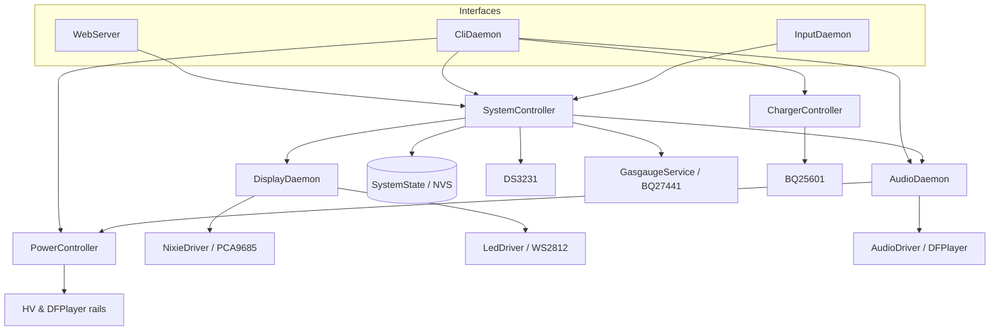

# Nixie Clock Firmware

Open-source ESP-IDF firmware for a 6-tube Nixie clock powered by an ESP32-S3. The clock drives multiplexed IN-18 (or IN-4) tubes with RGB backlighting, audio playback, battery management, and a built-in web configuration UI.

Whether you want to hack on display effects, add CLI tools, improve the web UI, or bring up new hardware, this guide will get you building with [PlatformIO](https://platformio.org/) quickly.

## Features

- **6-tube display** — Multiplexed control via PCA9685 PWM drivers and a 74HC238 anode mux.
- **RGB backlight** — WS2812 addressable LEDs (4 per tube) with static, breath, rainbow, and off effects.
- **Audio** — DFPlayer Mini integration for sound effects and announcements.
- **RTC** — DS3231 for precise timekeeping with periodic resync to ESP32 system time.
- **Web UI** — Wi-Fi access point and HTTP server for settings and time configuration from a phone or laptop.
- **Buttons** — Debounced physical inputs for display mode, backlight profile, and interactive modes.
- **Serial CLI** — Interactive console for development, diagnostics, and power-rail control.
- **Power management** — BQ25601 battery charger, BQ27441 fuel gauge, and switched HV / DFPlayer rails.
- **Persistent settings** — Clock preferences stored in NVS and restored on boot.
- **Modular architecture** — FreeRTOS daemons coordinated by a central system controller.

## Developing with PlatformIO

This project uses **PlatformIO + ESP-IDF**. You can work from VS Code / Cursor or from the CLI.

### 1. Install tools

1. Install [Git](https://git-scm.com/) and [Python 3](https://www.python.org/downloads/) (needed for the git-version build script).
2. Install either:
   - **Recommended:** [VS Code](https://code.visualstudio.com/) or Cursor with the [PlatformIO IDE](https://platformio.org/install/ide?install=vscode) extension, or
   - [PlatformIO Core (CLI)](https://docs.platformio.org/en/latest/core/installation.html) alone.
   For now, the PlatformIO for cursor is not stable, so I recommand to use VSCode to compile and use Cursor for coding. 

Opening this repo in VS Code / Cursor should prompt you to install the recommended `platformio.platformio-ide` extension (see `.vscode/extensions.json`).

### 2. Clone and open the project

```bash
git clone https://github.com/HabonRoof/nixietube_clock.git
cd nixietube_clock
```

In VS Code / Cursor: **File → Open Folder** and select the repo root (the folder that contains `platformio.ini`).

First build will download the Espressif platform, ESP-IDF toolchain, and dependencies into `.pio/` — expect a few minutes on a clean machine.

### 3. Pick a build environment

Defined in `platformio.ini`:

| Environment | Board | Use case |
| :--- | :--- | :--- |
| `esp32_s3_devkitc_1` (default) | ESP32-S3-DevKitC-1 | General development / bring-up |
| `eps32_s3_nixie` | Custom `esp32-s3-nixie` (`boards/`) | Production Nixie clock board |

Switch the active env in the PlatformIO status bar, or pass `-e <name>` on the CLI.

### 4. Everyday commands

| Action | CLI | VS Code / Cursor (PlatformIO) |
| :--- | :--- | :--- |
| Build | `pio run` | Build (✓) |
| Flash | `pio run -t upload` | Upload (→) |
| Serial monitor | `pio run -t monitor` | Serial Monitor (🔌) |
| Build + flash + monitor | `pio run -t upload && pio run -t monitor` | Upload and Monitor |
| Clean | `pio run -t clean` | Clean |
| Build for Nixie board | `pio run -e eps32_s3_nixie` | Select `eps32_s3_nixie` env, then Build |

Serial monitor is **115200 baud** (8N1). After connect you should see boot logs and the CLI prompt `nixie_clock> `.

Useful PlatformIO tips:

```bash
# Rebuild from a clean slate
pio run -t clean && pio run

# Flash a specific env, then open the monitor
pio run -e esp32_s3_devkitc_1 -t upload
pio run -t monitor

# List detected serial ports if upload fails
pio device list
```

The build embeds the current git commit hash via `generate_git_version.py` (`get_fw_version` in the CLI).

### 5. Verify you are up and running

1. Flash firmware and open the serial monitor.
2. Type `help` at `nixie_clock> ` to list CLI commands.
3. Optionally join the device Wi-Fi AP (`NixieClock` / `nixie2026`) and open `http://192.168.8.8/`.

If something fails to compile or upload, check:

- The board is in download mode / USB cable is data-capable.
- The correct env is selected (`esp32_s3_devkitc_1` vs `eps32_s3_nixie`).
- Python can run `generate_git_version.py` from the project root.
- Antivirus or missing udev/driver issues are not blocking the serial port (Windows often needs the ESP32 USB serial driver).

### 6. Where to start hacking

| Goal | Start here |
| :--- | :--- |
| Boot / wiring of subsystems | `src/main.cpp` |
| Mode logic, time, settings | `src/system_controller.*` |
| Tubes / LED effects | `src/daemons/display_daemon.*` |
| Buttons | `src/daemons/input_daemon.*` |
| Audio / DFPlayer | `src/daemons/audio_daemon.*` |
| Serial commands | `src/daemons/cli_daemon.*` |
| Web settings UI | `src/web_server.cpp`, `src/web_page.cpp` |
| Device drivers | `lib/drivers/`, `lib/include/` |
| Shared messages / state | `lib/include/message_types.h`, `src/system_state.*` |

## Software Structure

The firmware is split into clear layers so new contributors can find the right file quickly.

```text
┌─────────────────────────────────────────────────────────────┐
│  Interfaces                                                 │
│    WebServer  ·  CliDaemon  ·  InputDaemon (buttons)        │
├─────────────────────────────────────────────────────────────┤
│  Coordination                                               │
│    SystemController  ·  SystemState (NVS)                   │
├─────────────────────────────────────────────────────────────┤
│  FreeRTOS daemons                                           │
│    DisplayDaemon  ·  AudioDaemon                            │
├─────────────────────────────────────────────────────────────┤
│  App drivers / services                                     │
│    NixieDriver · LedDriver · AudioDriver                    │
│    PowerController · ChargerController · GasgaugeService    │
├─────────────────────────────────────────────────────────────┤
│  Hardware drivers (lib/drivers)                             │
│    PCA9685 · WS2812 · DFPlayer · DS3231 · BQ25601 · BQ27441 │
└─────────────────────────────────────────────────────────────┘
```

### Directory map

```text
nixietube_clock/
├── platformio.ini          # PlatformIO envs, ESP-IDF, build flags
├── boards/                 # Custom board JSON (esp32-s3-nixie)
├── generate_git_version.py # Embeds git hash into the firmware
│
├── src/                    # Application code (what most PRs touch)
│   ├── main.cpp            # Boot: NVS, drivers, start daemons
│   ├── system_controller.* # Central coordinator (time, modes, settings)
│   ├── system_state.*      # Thread-safe settings / battery / time + NVS
│   ├── web_server.*        # Wi-Fi AP + HTTP API
│   ├── web_page.*          # Embedded settings HTML/JS
│   ├── nixie_driver.*      # High-level tube multiplexing
│   ├── led_driver.*        # High-level WS2812 control
│   ├── audio_driver.*      # High-level DFPlayer wrapper
│   ├── power_controller.*  # HV / DFPlayer rail switching
│   ├── charger_controller.*
│   ├── gasgauge_service.*
│   ├── color_model.cpp     # Color helpers for backlight
│   └── daemons/
│       ├── display_daemon.*  # Nixie + LED effects @ 50 Hz
│       ├── audio_daemon.*    # Async audio commands
│       ├── input_daemon.*    # Button debounce → SystemController
│       └── cli_daemon.*      # Serial console
│
├── lib/
│   ├── include/            # Public headers / interfaces / message types
│   └── drivers/            # Low-level IC drivers (I2C/UART/RMT/GPIO)
│       ├── pca9685/
│       ├── ws2812/
│       ├── dfplayer/
│       ├── ds3231/
│       ├── bq25601/
│       ├── bq27441/
│       ├── i2c_bus/
│       ├── power_switch/
│       └── display_board/
│
├── hardware/               # KiCad schematics & PCBs (main, display, HV)
├── test/                   # Manual CLI tests and component experiments
└── doc/                    # Datasheets, photos, architecture drawings
```

### Responsibility cheat sheet

| Module | Role |
| :--- | :--- |
| `main.cpp` | Creates drivers/services, wires dependencies, starts tasks |
| `SystemController` | Owns RTC sync, display mode / backlight / alarm logic; single writer for settings |
| `SystemState` | Shared snapshots + NVS load/save |
| `DisplayDaemon` | Tube digits, LED effects, 50 Hz update loop |
| `AudioDaemon` | Plays/pauses tracks; powers DFPlayer rail via `PowerController` |
| `InputDaemon` | Polls/debounces BTN_0–2 and posts presses to `SystemController` |
| `CliDaemon` / `WebServer` | External control surfaces; request settings through `SystemController` |
| `lib/drivers/*` | Talk to chips; keep bus/register details out of app logic |

Cross-task communication uses FreeRTOS queues and types in `lib/include/message_types.h`. Prefer posting messages (or `SystemController::request_settings_update()`) over reaching into another daemon’s private state.

## Hardware Configuration

Pin assignments are defined in `src/system_controller.cpp` and `lib/drivers/power_switch/gpio_power_switch.h`.

| Peripheral | Pin Name | GPIO | Description |
| :--- | :--- | :--- | :--- |
| **I2C** | SDA | GPIO 6 | I2C data (DS3231, PCA9685, BQ25601, BQ27441) |
| | SCL | GPIO 5 | I2C clock (400 kHz) |
| **UART** | TX | GPIO 18 | Audio TX → DFPlayer RX |
| | RX | GPIO 17 | Audio RX ← DFPlayer TX |
| **GPIO** | RTC_INT | GPIO 2 | DS3231 interrupt (active low) |
| | BTN_0 | GPIO 8 | Alarm stop / pomodoro start / divergence re-trigger |
| | BTN_1 | GPIO 12 | Display mode cycle |
| | BTN_2 | GPIO 13 | Backlight profile cycle |
| | PCA_OE | GPIO 4 | PCA9685 output enable (active low) |
| | ANODE_A0–A2 | GPIO 9–11 | 74HC238 anode mux address lines |
| | HV_PWR | GPIO 15 | HV power rail enable (via `GpioPowerSwitch`) |
| | DF_PWR | GPIO 16 | DFPlayer power rail enable (via `GpioPowerSwitch`) |
| **RMT** | LED_DATA | GPIO 7 | WS2812 LED data line |

KiCad schematics and PCB layouts for the main board, display boards (IN-18 / IN-4), and HV power supply live under `hardware/`.

## Architecture

The firmware runs on FreeRTOS and uses a daemon-based design. `SystemState` holds shared, thread-safe snapshots of settings, battery, and time status.



### System Controller (`src/system_controller.cpp`)

Central coordinator that:

- Initializes I2C, UART, RMT, and GPIO peripherals.
- Owns the DS3231 RTC and maintains ESP32 system time (UTC).
- Periodically resyncs from the RTC and publishes time status.
- Polls the BQ27441 fuel gauge and updates battery status.
- Dispatches 1 Hz time updates to `DisplayDaemon`.
- Handles button presses from `InputDaemon` (modes, backlight, pomodoro / alarm).
- Accepts thread-safe settings changes from the web UI and CLI.

### Display Daemon (`src/daemons/display_daemon.cpp`)

Manages all visual output:

- Drives Nixie tubes via `NixieDriver` (dedicated high-priority multiplexing task).
- Drives LED backlights via `LedDriver`.
- Runs the LED effects engine (static, breath, rainbow, off).
- Updates hardware at 50 Hz.

#### Display modes (BTN_1 cycle)

Press **BTN_1** to cycle through display modes in this order:

1. **Clock** (`HHMMSS`) — normal time display
2. **Date** (`YYMMDD`) — current date
3. **Pomodoro** — 25-minute work / 5-minute break timer
4. **Divergence meter** — random digit animation (auto-returns to clock)
5. **Cathode poisoning** — digit sweep on all tubes (auto-returns to clock)

**Pomodoro mode:** On entry the display shows `002500` with a static red backlight (brightness follows your profile). Press **BTN_0** to start the countdown; the backlight breathes red during work and green during break. Work and break sessions alternate automatically until you cycle away with **BTN_1**, which restores your backlight profile.

### Input Daemon (`src/daemons/input_daemon.cpp`)

Polls the three front-panel buttons every 20 ms with debounce / inter-press filtering, then posts press events to `SystemController`. Button pin map lives in `lib/include/button_config.h`.

### Audio Daemon (`src/daemons/audio_daemon.cpp`)

Handles asynchronous audio commands (play, stop, volume) and communicates with the DFPlayer Mini. Uses `PowerController` to switch the DFPlayer power rail.

### Web Server (`src/web_server.cpp`, `src/web_page.cpp`)

Starts a Wi-Fi access point and embedded HTTP server:

| Setting | Value |
| :--- | :--- |
| SSID | `NixieClock` |
| Password | `nixie2026` |
| AP IP | `192.168.8.8` |

Connect to the AP and open `http://192.168.8.8/` in a browser.

| Endpoint | Method | Description |
| :--- | :--- | :--- |
| `/` | GET | Settings web UI |
| `/api/settings` | GET | Current clock settings (JSON) |
| `/api/settings` | POST | Apply settings and optional time (JSON) |
| `/api/time` | GET | Local time, RTC status, temperature (JSON) |

Configurable settings include timezone offset, alarm, backlight color/brightness/effect, and volume.

### CLI Daemon (`src/daemons/cli_daemon.cpp`)

Interactive serial console for development, diagnostics, and factory setup. Connect at **115200 baud** (8N1, no flow control) via USB or UART. The prompt is `nixie_clock> `. Type `help` for a summary of all commands.

```bash
pio run -t monitor
```

#### Display and backlight

| Command | Description |
| :--- | :--- |
| `set_nixie --number <n>` | Display a 6-digit number on the tubes |
| `set_backlight --rgb R,G,B --brightness N` | Set backlight color and brightness (0–255) |

#### Device info

| Command | Description |
| :--- | :--- |
| `get_uuid` | Wi-Fi MAC-based device ID |
| `get_hw_version` | ESP32-S3 chip and board revision |
| `get_fw_version` | Git commit hash and ESP-IDF version |
| `reboot` | Restart the device |

#### RTC and alarm (`rtctool`)

The DS3231 RTC stores **UTC** internally; CLI time and alarm values are **local wall clock** and are converted using the configured timezone offset. Set operations are asynchronous — run `rtctool read` afterward to confirm.

| Subcommand | Description |
| :--- | :--- |
| `rtctool read` | Read local time, UTC epoch, timezone, calibration/OSF status, temperature, and alarm settings |
| `rtctool set_tz <offset_hours>` | Set timezone offset (-12..+14) |
| `rtctool set_time <YYYY-MM-DD HH:MM:SS>` | Calibrate RTC and system clock (marks RTC as calibrated) |
| `rtctool set_alarm <HH:MM:SS> [--enable\|--disable] [--track <n>]` | Set daily alarm time; enables alarm by default |

Example workflow:

```text
nixie_clock> rtctool set_tz 8
nixie_clock> rtctool set_time 2026-07-06 16:30:00
nixie_clock> rtctool set_alarm 07:30:00 --enable --track 1
nixie_clock> rtctool read
```

To disable the alarm without changing its time:

```text
nixie_clock> rtctool set_alarm 07:30:00 --disable
```

#### Power and charging

| Command | Description |
| :--- | :--- |
| `get_bq25601_status` | Read BQ25601 charger status registers |
| `enable_charging` / `disable_charging` | Control battery charging |
| `enable_hv` / `disable_hv` | Control HV power rail |
| `enable_df_power` / `disable_df_power` | Control DFPlayer power rail |

#### DFPlayer audio (`dftool`)

Commands talk to the `AudioDaemon`, which powers the DFPlayer rail automatically when needed. Place MP3 files in an `mp3` folder on the SD card root and name them `0001.mp3`, `0002.mp3`, etc. (up to 9999). Track numbers match the numeric prefix in each filename.

| Subcommand | Description |
| :--- | :--- |
| `dftool list` | List tracks in the SD card `mp3/` folder |
| `dftool status` | Show current track, playback state, and track count |
| `dftool play <track> [--loop]` | Play a track; add `--loop` for repeat |
| `dftool toggle <track>` | Play/pause toggle (same behavior as the web UI) |
| `dftool pause` | Pause playback |
| `dftool resume` | Resume playback |
| `dftool stop` | Stop playback |
| `dftool next` | Play next track |
| `dftool prev` | Play previous track |
| `dftool volume <0-30>` | Set volume (DFPlayer range) |
| `dftool vol_up` / `dftool vol_down` | Step volume up or down |

Example workflow:

```text
nixie_clock> dftool list
nixie_clock> dftool play 1
nixie_clock> dftool status
nixie_clock> dftool pause
nixie_clock> dftool resume
nixie_clock> dftool volume 20
nixie_clock> dftool stop
```

#### Fuel gauge (`ggtool`)

| Subcommand | Description |
| :--- | :--- |
| `ggtool status` | Probe BQ27441 device info and gauging readiness |
| `ggtool read` | Read live SOC, SOH, voltage, and current |
| `ggtool cache` | Read last cached battery values from `SystemState` |
| `ggtool peek <reg_hex> [len]` | Dump raw register bytes |
| `ggtool block [class] [index]` | Dump a 32-byte state block |
| `ggtool config [mAh]` | Configure design capacity |

See `test/test_cli/README.md` for a manual test plan and automated test script.

### Drivers (`lib/drivers/`, `src/*_driver.cpp`)

| Driver | Role |
| :--- | :--- |
| `NixieDriver` | 4× PCA9685 chips driving 6 tubes with multiplexing |
| `LedDriver` | RMT-based WS2812 control |
| `AudioDriver` | High-level DFPlayer Mini interface |
| `Ds3231` | RTC read/write and temperature |
| `Bq25601` | Battery charger IC |
| `Bq27441` | Fuel gauge IC |
| `GpioPowerSwitch` | HV and DFPlayer power-rail switching |

## Development Guide

### Adding a New LED Effect

1. Add a method such as `run_my_effect(uint32_t dt_ms)` in `DisplayDaemon`.
   Use `apply_backlight_to_all(state)` or manipulate `led_driver_` directly.
2. Add an entry to the `LedEffectType` enum in `display_daemon.h`.
3. Update `DisplayDaemon::process_message` to handle the new effect type.
4. Update `DisplayDaemon::update_effects` to call the new method.
5. Expose the effect in the web UI (`web_page.cpp`) and settings schema (`system_state.h`).

### Applying Settings from a New Interface

Use `SystemController::request_settings_update()` so the system controller task remains the sole owner of RTC and settings state. Read current values from `SystemState` and persist with `SystemState::save_settings()`.

### Adding a CLI Command

1. Register parsing / help text in `src/daemons/cli_daemon.cpp`.
2. Prefer calling existing controllers/daemons (`SystemController`, `AudioDaemon`, `PowerController`, …) instead of talking to hardware directly.
3. Document the command in this README under **CLI Daemon**.

## Contributing

Contributions are welcome — effects, CLI tools, web UI polish, driver fixes, docs, and hardware errata all help.

1. Fork the repo and create a feature branch.
2. Build with PlatformIO (`pio run`) and smoke-test on hardware or a DevKit when possible.
3. Keep changes focused; match the existing modular daemon style.
4. Open a pull request describing **what** changed and **how to test** it.

If you are unsure where something belongs, open an issue first — happy to point you at the right module.
